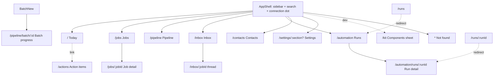

# Information architecture
TOC: Rule · Navigation · Screens (as-is) · Delta 2026-10-04 · Trim list

## Rule (DEC-009)
Minimal IA: each screen/section/control cites an approved REQ/UC/FLOW. No citation → Trim list. Quality bar: Vercel Web Interface Guidelines (`web-design-guidelines` audit per frontend PR). New surface = REQ first (`/product change`).

## Navigation

Sidebar groups (max 6 items, user decision 2026-10-04): **Job search** = Today (open-actions count), Jobs, Pipeline, Inbox (count). **More** = Profile (when TASK-013 lands), Settings. Runs (Automation) open from Today's recent runs, Contacts from a job's detail; their routes stay.
Not in nav: Action items (linked from Today), Kit, batch pages, detail pages. Global: search box (Cmd/Ctrl+K) -> `/jobs?q=`.

| Route | Screen | Purpose |
|---|---|---|
| `/` | Today | what needs me now, runs, schedule, funnel |
| `/jobs` | Jobs | live tracker table, filters, saved views |
| `/jobs/:jobId` | Job detail | one job: status, safety, docs, apply, contacts |
| `/pipeline` | Pipeline | funnel counts + application cards by stage |
| `/pipeline/batch/:id` | Batch progress | live per-job progress, pause/cancel/retry |
| `/actions` | Action items | all tasks grouped by due/priority/needs |
| `/inbox`, `/inbox/:jobId` | Inbox & follow-ups | post-apply threads, drafts |
| `/contacts` | Contacts | outreach people, connection state |
| `/automation` | Runs | now / up next / start run / history / schedule |
| `/automation/runs/:runId` | Run detail | attempts + log |
| `/runs`, `/runs/:runId` | (redirect) | old paths -> `/automation...`, query kept |
| `/settings/:section?` | Settings | grouped config; default section redirect |
| `/kit` | Kit | component + token sheet |
| `*` | Not found | placeholder |

## Screens

### SCREEN-Today (as-is)
- Purpose: daily landing; what needs the user, automation health.
- Sections: header actions (queue/run start), paused banner, catch-up banner, "Needs you" action list (grouped by Needs), side aside: recent runs, next scheduled, pipeline chart.
- Primary action: mark action Done (undo toast); header run button.
- Entry: sidebar `/`, brand, redirects.
- Dialogs: undo toast; link out to `/actions`, run/job pages.

### SCREEN-Jobs
- Purpose: tracker as live table; find/edit any job.
- Sections: status tabs w/ counts, search, saved views, active filter chips (+Clear all), table (column header filter menus, sort), pager, export xlsx, open folder.
- Primary action: open job row; inline edit Status/Override/Notes.
- Entry: sidebar, global search, Today/Pipeline funnel links (filter in URL `f.<field>=`).
- Dialogs: header filter Menu/Popover, row selection -> batch link.

### SCREEN-JobDetail
- Purpose: everything about one job.
- Sections: header (company, breadcrumb, status stepper, actions), Next step (pipeline) card, Safety, Score, Posting, Documents, Apply session (screenshots viewer), Contacts & outreach, Activity; Evidence.
- Primary action: Next step button (Prepare / Fill application / Apply).
- Entry: Jobs row, Pipeline card, Inbox, Today, Contacts.
- Dialogs/sheets: Safety sheets (verify/flag/clear), evidence sheet, screenshot viewer, DraftSheet, confirm dialogs (posting, apply, safety).

### SCREEN-Pipeline
- Purpose: funnel + applications board.
- Sections: funnel counts (link to Jobs by stage), columns Applied / Screening / Interview / Offer, Closed link, filters (tier, category, safety, location).
- Primary action: "Move to..." status chooser.
- Entry: sidebar.
- Sheets: StatusChooser sheet; no drag.

### SCREEN-BatchNew / BatchProgress
- Purpose: plan then monitor a multi-job batch.
- New: Stop-after segmented, quantity/custom number, job list with exclusion reasons, confirm panel.
- Progress: summary, per-job rows, Pause/Cancel/Retry; ConfirmPanel for cancel.
- Entry: Jobs "Start pipeline" review; Start redirects to progress.

### SCREEN-ActionItems
- Purpose: full task list.
- Sections: tabs Open/Today/Done, group by Due/Priority/Needs, sort, rows with due text + reason, bulk done, scam controls.
- Primary action: MarkDoneCircle (undo toast).
- Entry: Today link only.
- Sheets: AddItemSheet, DueSheet.

### SCREEN-Inbox
- Purpose: post-apply replies, follow-up drafts.
- Sections: thread list (applied jobs, days since, classification), selected thread pane (note, draft letter region), master/detail by `:jobId`.
- Primary action: Send/Edit/Skip draft (manual send).
- Entry: sidebar (count), job links.
- Sheets: DraftSheet.

### SCREEN-Contacts
- Purpose: outreach people per job.
- Sections: filters (SegmentedControl connection degree, sort), contact rows (confidence, draft/sent/replied), mutual/connected badge.
- Primary action: Open draft / Tailor manually.
- Sheets: MarkConnectionSheet, DraftSheet.

### SCREEN-Runs (`/automation`)
- Purpose: what runs by itself, when, did it work.
- Sections: banners (paused, catch-up), Current run card, Up next / queue (kind Queue segmented), Start run card (Run kind, budget presets), Schedule panel, History card (stop-reason chips).
- Primary action: Start run / Pause all / Cancel.
- Entry: sidebar, Today recent runs.
- Dialogs: ConfirmPanel (cancel/pause), schedule panel.

### SCREEN-RunDetail
- Purpose: one run: attempts table + log.
- Sections: header summary, attempts, LogPane (live tail).
- Entry: History row, Today recent runs.

### SCREEN-Settings
- Purpose: edit config YAML as grouped lists.
- Sections: left nav (`aria-label=Settings sections`), primary sections + collapsed Advanced (storage, quality checks); GroupCards of FieldRows; storage subpages; SaveBar.
- Primary action: Save (SaveBar, unsaved guard).
- Entry: sidebar, `/settings/<section>` deep link.
- Dialogs: SaveBar confirm, PruneNow confirm.

### SCREEN-Kit
- Purpose: internal components/tokens sheet (light+dark via data-theme). Not in nav.

### SCREEN-NotFound
- Purpose: unknown route placeholder.

## Delta 2026-10-04 — profile, readiness, select, check a job, fill preview
New/changed (bold = new). Frontend tasks: TASK-013..015, TASK-014.

| where | change | REQ / UC / FLOW |
|---|---|---|
| nav | **Profile** top-level item (after Kit) | REQ-107 UC-009 |
| Today | **Readiness card** (top): next open must-have + link; "Ready to apply" when done | REQ-102 UC-006 FLOW-001 |
| Jobs list | **row checkbox + select-all/bulk bar** (Select / Unselect); **injection badge** on flagged rows | REQ-104 REQ-109 UC-007 UC-012 |
| Jobs list | **"Check a job" button** → dialog | REQ-114 UC-010 FLOW-003 |
| Job detail | **résumé match table** (résumé, score, best, reason); **flag banner** + "I checked it" | REQ-115 REQ-109 UC-010 UC-012 |
| Job detail | **Preview fill** sheet before Fill | REQ-105 REQ-106 UC-008 |
| apply paths | buttons disabled + reason when readiness not met | REQ-103 UC-006 |

### SCREEN-Profile (new)
Purpose: everything the candidate supplies once, reused for every job. Route `/profile`, tabs:
- **Résumés**: drop zone (PDF/DOCX), list (name, master/variant, versions, status reviewing/ready/failed) → résumé detail: versions (author, time, source), feedback items (Apply/Comment/Dismiss), Edit, ATS view, Make master (→ master.yaml diff approve). REQ-093..100, UC-001..004, FLOW-002.
- **Writing samples**: upload/remove, learn-voice status + Retry. REQ-101 UC-005.
- **Saved answers**: table question/answer/key, edit/delete (confirm). REQ-107 UC-009.
- **Learned**: apply lessons + voice style (read-only, delete lesson). REQ-107.
- **Readiness**: same checklist as Today card. REQ-102.
Primary action: upload résumé (first run) / next open readiness item. Entry: nav, Today readiness card, apply-disabled reason links.
Empty: first run shows drop zone + checklist only. Destructive (delete version/answer/sample) = confirm dialog; master version delete refused with reason.

### SCREEN-CheckJob dialog (new)
Purpose: paste/upload a JD found outside scout → fit + best résumé. Entry: Jobs list button. FLOW-003.
Steps in one dialog: input (textarea or file; inline errors type/size/no text) → progress → result: fit score, flag notice if flagged, match table, primary "Use this résumé" or "Tailor from master?" → below-threshold notice "best X / needed Y + missing" with Keep closest / Discard. Close any time: job kept.

### SCREEN-FillPreview sheet (new)
Purpose: see and edit every value before the browser fill. Entry: Job detail "Preview fill" (replaces direct Fill). UC-008.
Table field / value / source (profile, answer, ai, unknown); edit inline; unknown rows ask (fill / skip if optional, "save to profile" toggle). Fill disabled + reason while required unanswered or legal/salary/EEO pending.

## Page guidance (USR-035)
Every screen: one-line purpose + next step under h1; empty state says what to do; disabled buttons say why (UnavailableButton). Nav ≤6 items, plain names.

## Trim list
Candidates only; not removed yet. Decide per item at audit triage gate (61 proposed audit REQs). Kept only if an approved REQ cites it. Frontend TASK-013..015 trim their touched screens first.

| surface | why candidate | likely fate |
|---|---|---|
| `/kit` page | dev-only sheet, no user REQ | drop from build or dev flag |
| `/runs*` redirects | legacy paths | drop |
| Pipeline board + funnel | duplicates Jobs status tabs | fold into Jobs status filter |
| Batch new page | replaced by Jobs "Start pipeline" + review sheet (FLOW-004) | fold into Jobs; keep progress page |
| Today side panel (runs, schedule, funnel chart) | not in any approved REQ | readiness card + Needs you only |
| Jobs saved views, export xlsx, open folder | no REQ (Excel-style table, filters, row-count pager KEPT: USR-036) | drop unless audit REQ approved |
| Contacts page, outreach drafts | outreach USR not triaged | decide at triage |
| Inbox drafts pane | depends on inbox REQs (triage) | decide at triage |
| Runs: schedule panel, queue kinds, budget presets | partly duplicated by CLI | keep minimum the run REQs need |
| Job detail: Evidence sheet, Activity, screenshot viewer | no approved REQ | decide at triage |
| Settings Advanced (storage, quality checks) | config edit in YAML works | decide at triage |
| Tokens unused by any screen (`--fs-large-title`, `--fs-tab`) | phone screens never built | drop |
