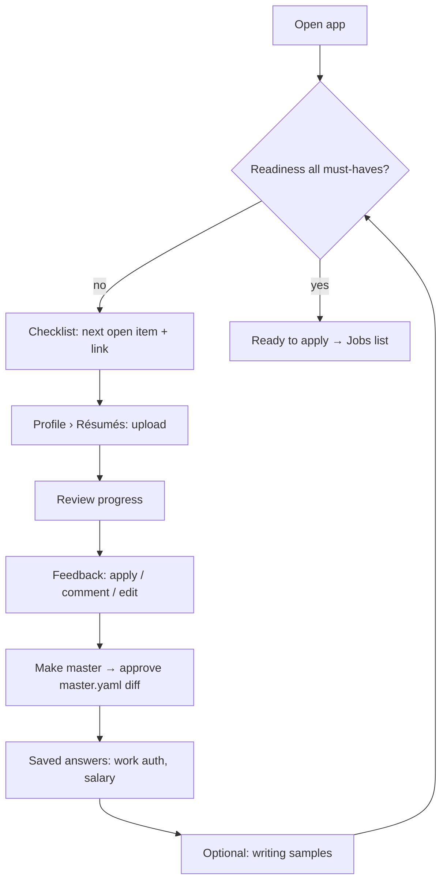
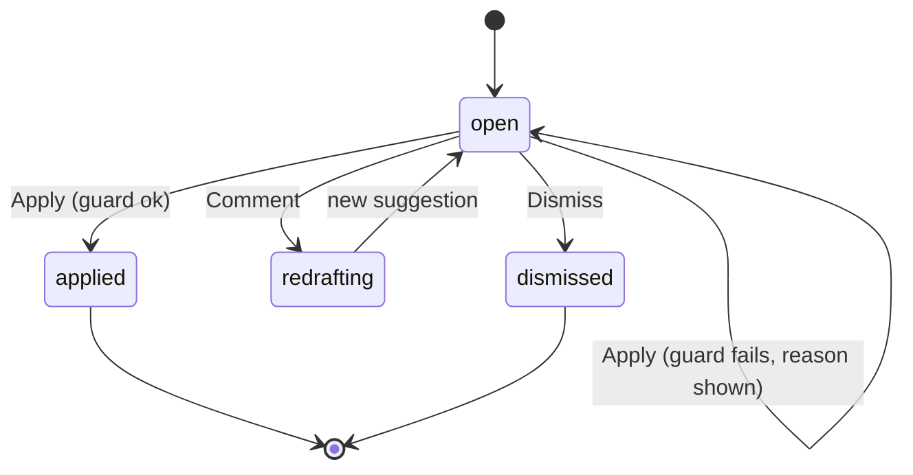
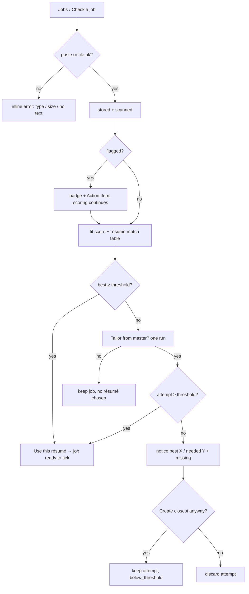

# User flows
Only flows with branching or state. Status in trace.yaml.

### FLOW-001 First run to ready
UCs: UC-001, UC-002, UC-003, UC-005, UC-006

What to notice: the checklist is the hub; every step returns to it, so a user who leaves mid-way resumes at the next open item.

### FLOW-002 Feedback item lifecycle
UCs: UC-002

What to notice: nothing reaches the résumé except via `applied`, and only after the zero-fabrication guard.

### FLOW-003 Check a job
UCs: UC-010

What to notice: max one tailor run per check; a flagged posting is still scored but can't be prepared until cleared.

### FLOW-004 Select jobs → start pipeline
UCs: UC-007 (+ USR-034; REQs to derive)
```mermaid
flowchart TD
  A[Jobs list] --> B[filter / sort optional]
  B --> C[tick jobs: row, select visible, bulk]
  C --> D[Start pipeline]
  D --> E[Review sheet: one 'Go as far as' for all (default Fill, I submit), override per row: Prepare / Fill / Submit]
  E --> F{readiness ok for fill/submit?}
  F -- no --> F1[those rows capped at Prepare, reason + link to Profile]
  F -- yes --> G
  F1 --> G[Start] --> H[Progress: per-job stage, Pause / Cancel / Retry]
  H --> I[done: Prepared / Filled (open tab) / Submitted / Needs you]
```
What to notice: one entry point (Start pipeline on the Jobs list); stop stage chosen per job; Tier A + LinkedIn never offered Submit.
