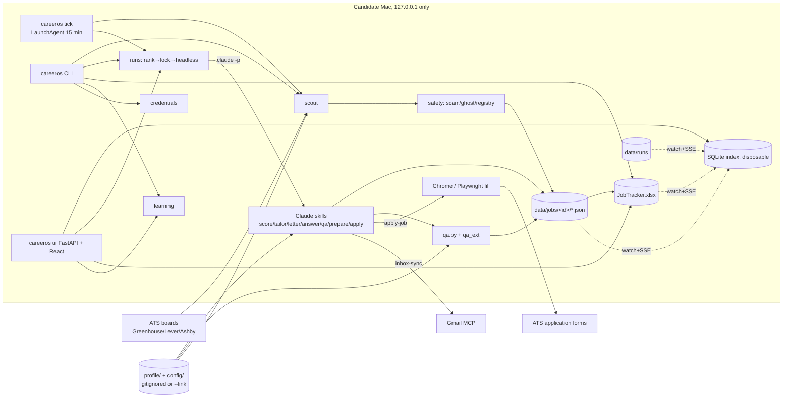
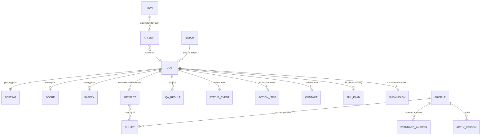
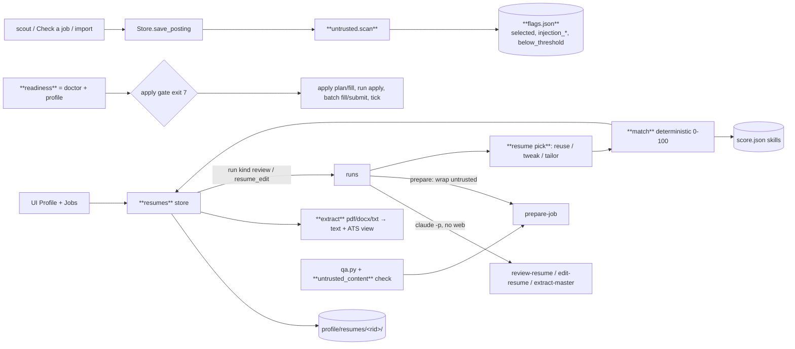
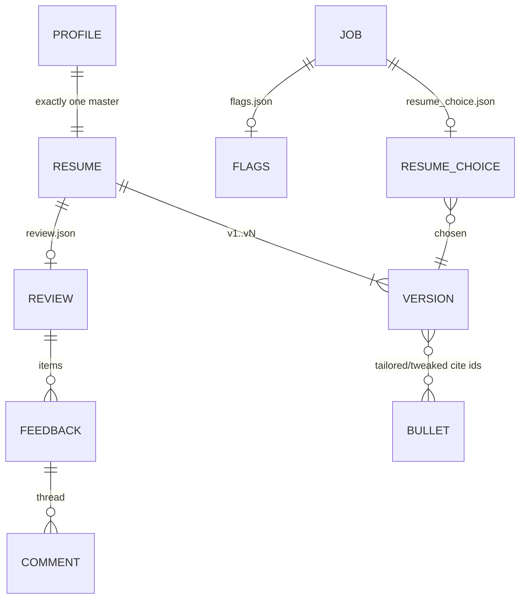
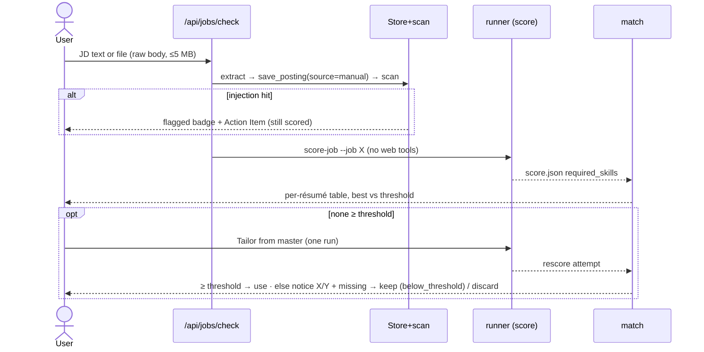
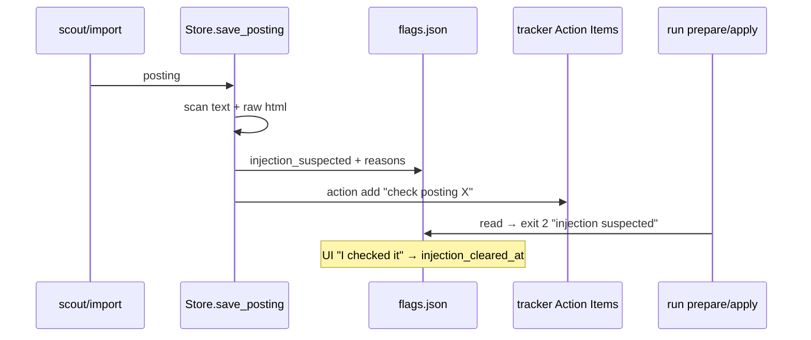

# Architecture — as-is (audit 2026-10-04)
Full detail: repo-root `ARCHITECTURE.md` (canonical design doc) + `docs/UI.md`. This file = product-level view + threat model only.

## Components

What to notice: files under `data/` are canonical; SQLite + xlsx are views. LLM only runs via `claude -p` one skill/job; Python owns ranking, budgets, locks, caps.

## Data model

What to notice: ARTIFACT→BULLET by id is the anti-fabrication contract. ACTION_ITEM still lives in the xlsx (move to JSON pending, TODO.md:52).

## AuthN / AuthZ
- UI binds 127.0.0.1 only; LAN deferred until auth + TLS (TODO.md:50). Host/CSRF checks: see `src/careeros/ui/security.py`.
- ATS creds: `~/.careeros/credentials.yaml` 0600 or macOS keychain; redacted from run logs.

## Threat model
| asset | boundary | surface | abuse | mitigation |
|---|---|---|---|---|
| Candidate PII (profile, answers) | public template repo | git push | personal data committed | gitignore, pre-push hook, CI PII guard |
| PII in forms | ATS / scam sites | apply-job | data harvesting | safety verdict, data minimization, sensitive labels never answered |
| Employer confidential terms | generated artifacts | résumé/letter/outreach | leak | QA `confidential_terms` hard fail |
| ATS passwords | run logs, repo | headless stream | leak | redactor, 0600, keychain, doctor warn |
| Local UI | browser on same host | HTTP/SSE | DNS rebinding / CSRF from other sites | loopback bind, host + origin checks |
| Candidate reputation | ATS / recruiters | auto-submit, outreach | wrong company / double submit / spam | QA wrong_company, submit-once, Tier A assisted, LinkedIn draft-only, daily cap |
| Prompt injection via posting text | LLM skills | posting description | skill misled into actions | `dontAsk` + allowedTools; (decision-needed Q-007) |

## Delta 2026-10-04 — profile, injection guard, résumé reuse, check a job
Scope: REQ-093..116, UC-001..012. Decisions: DECISIONS.md DEC-001..008. Nothing below exists yet.

### Components (new = bold)

What to notice: one choke point each — `save_posting` scans every posting, `readiness` gates every apply path, `match` is the only scorer for résumé choice. LLM never decides reuse.

### Storage layout
| path | content | writer |
|---|---|---|
| `profile/resumes/<rid>/meta.json` | name, type `master\|variant\|other\|tailored`, category, versions `[{n, author user\|ai, source, at, below_threshold?}]` | `resumes.py` atomic |
| `profile/resumes/<rid>/v<n>/` | `original.<ext>` (uploads), `text.txt`, `ats.json`, `resume.json` (tailored/tweaked only, bullet ids) | `resumes.py` |
| `profile/resumes/<rid>/review.json` | state `running\|done\|failed`, run_id, items `{id, section, issue, suggestion, state, comments[]}` | review skill via CLI |
| `profile/master.proposed.yaml` | pending master.yaml diff (REQ-099); readiness open while present | extract-master; approve = ruamel write |
| `data/jobs/<id>/flags.json` | `selected`, `injection_suspected`, `injection_reasons[]`, `injection_cleared_at`, `below_threshold` | Store |
| `data/jobs/<id>/resume_choice.json` | per résumé `{rid, n, score, missing[]}`, chosen, action `reuse\|tweak\|tailor`, reason | `resume pick` |
Missing `flags.json` = legacy job → `selected: true` (REQ-104). New postings get `selected: false`.

### Data model delta

What to notice: a job links to a résumé version instead of always owning a fresh one; tailored output becomes a `tailored` résumé reusable by later jobs.

### Sequences
UC-010 Check a job

What to notice: scoring an injected posting is allowed (no tools that act); only prepare/apply wait for "I checked it".

UC-011 Prepare with reuse
```mermaid
sequenceDiagram
  participant Run as run prepare
  participant P as resume pick
  participant M as match
  participant Sk as prepare-job skill
  Run->>Run: eligibility: selected, not injection-blocked
  Run->>P: job X
  P->>M: score every résumé latest version
  alt best ≥ min_match
    P-->>Run: reuse rid/vN (no tailor)
  else tweak estimate ≥ min_match and gain ≥ min_tweak_gain
    P-->>Run: tweak base + ≤3 bullet ids
  else
    P-->>Run: tailor from master
  end
  Run->>Sk: prepare-job with resume_choice.json (posting in &lt;untrusted&gt;)
  Sk->>Sk: letter + answers (+ tweak/tailor only if asked) → qa
```
What to notice: the choice is Python, logged to `resume_choice.json` before any LLM call; the skill obeys it.

UC-012 Flag suspicious posting

What to notice: flag lives with the job, so CLI, UI and scheduler see the same block.

### FLOW-003 (UC-010) → USER_FLOWS.md

### Contracts
| endpoint / CLI | in | out / errors |
|---|---|---|
| `GET /api/readiness` · `careeros doctor` | – | `{ready, items:[{id,label,must,done,fix_link}]}` |
| apply paths (REQ-103) | – | CLI exit 7 `not ready: <ids>`; API 409 `{code:"not_ready", items}` |
| `POST /api/jobs/check` | raw body + `?filename=` or JSON `{text}` | 201 `{job_id, flagged, run_id}`; 413 >5 MB; 415 type |
| `GET /api/jobs/{id}/matches` | – | `[{rid,name,n,score,missing[]}]` sorted, `threshold` |
| `PATCH /api/jobs/{id}/flags` · `POST /api/jobs/select` | `{selected}` / `{ids,selected}` · `{injection_cleared:true}` | 200 flags |
| `PUT /api/profile/resumes?filename=` | raw body | 201 `{rid, n:1, review_run}`; 413/415 |
| `GET/PATCH/DELETE /api/profile/resumes/{rid}[/versions/{n}]` | `{name,type}` | 409 deleting master / latest of master |
| `POST /api/profile/resumes/{rid}/review` · `.../feedback/{fid}/apply\|comment\|dismiss` | `{text}` for comment | 202 run_id; apply guard fail → 422 `{reason}` |
| `POST /api/profile/resumes/{rid}/master` · `GET/POST /api/profile/master-diff` | `{decision: approve\|reject}` | diff text |
| `PUT/DELETE /api/profile/samples` · `GET/PUT/DELETE /api/profile/answers/{key}` | raw body / answer | triggers learn-voice run |
| `careeros resume list\|add\|pick <job>\|match <job>` | – | JSON with `--json` |

### Failure + recovery
- `claude` missing/timeout in review → `review.json state: failed`, Retry reruns; upload kept.
- Extraction fails → version stored, `ats.json warnings: ["no text found"]`, match = 0.
- Crash mid-write → atomic tmp+replace everywhere (existing `runs/atomic.py`).
- Pending `master.proposed.yaml` → readiness must-have open → apply blocked, prepare not.

### Threat model delta (prompt injection)
| asset | boundary | surface | abuse | mitigation |
|---|---|---|---|---|
| Profile PII, résumé | posting text → LLM | posting/JD/email/import text in prompts | "send résumé to x@y", exfil via URL | `<untrusted>` wrapping + skill rule; per-kind tools (DEC-005); output guard `untrusted_content` |
| Apply actions | posting → apply-job | hidden instructions read in browser | wrong submit / extra fields | scan flag blocks apply until cleared; Tier A never auto; readiness gate |
| Candidate reputation | artifacts | injected text echoed in letter | "as an AI…" in letter | QA instruction-echo hard fail → regen once → Action Item |
| Local files | uploads | crafted PDF/DOCX (zip bomb, huge) | DoS / path traversal | 5 MB cap, docx read capped, rid server-generated, never user path |
| Scan itself | heuristic | paraphrased injection | missed flag | defence in depth: tools + guard still apply; scan only adds a human check |
Residual: WebSearch query strings in prepare can still carry data to a search provider (accepted, DEC-005).

### Quality scenarios
| NFR / REQ | scenario | test |
|---|---|---|
| REQ-111 determinism | same résumé+job twice → identical score + missing list | ACCEPT-111 |
| REQ-109 | recorded posting with zero-width + CSS-hidden text → flagged | E2E-012-01 |
| REQ-108 | fake skill prompt build: posting inside `<untrusted>`; score argv has no WebFetch | SEC-01 |
| REQ-110 | letter with unknown URL/email → `untrusted_content` hard fail | E2E-012-02 |
| REQ-103 | must-have open → every apply path exit 7 / 409 | ACCEPT-103 |
