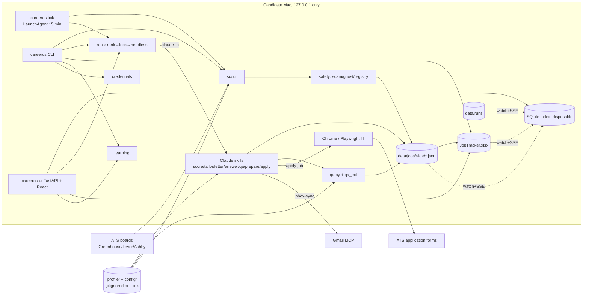
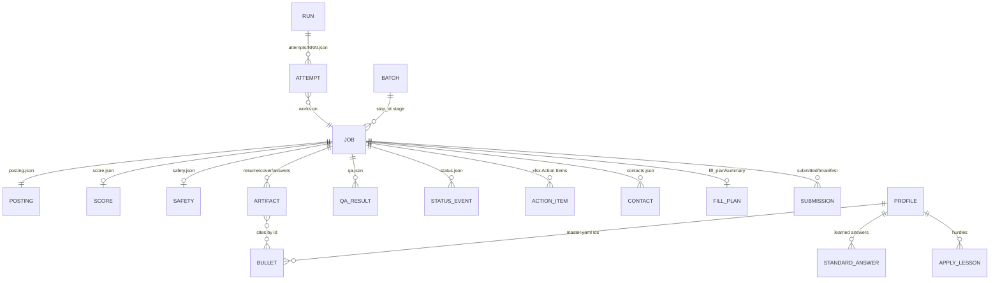

# Architecture — as-is (audit 2026-10-04)
Full detail: repo-root `ARCHITECTURE.md` (canonical design doc) + `docs/UI.md`. This file = product-level view + threat model only.

## Components

What to notice: files under `data/` are canonical; SQLite + xlsx are views. LLM only runs via `claude -p` one skill/job; Python owns ranking, budgets, locks, caps.

## Data model

What to notice: ARTIFACT→BULLET by id is the anti-fabrication contract. ACTION_ITEM still lives in the xlsx (move to JSON pending, TODO.md:52).

## AuthN / AuthZ
- UI binds 127.0.0.1 only; LAN deferred until auth + TLS (TODO.md:50). Host/CSRF checks: see `src/careeros/ui/security.py`.
- ATS creds: `~/.careeros/credentials.yaml` 0600 or macOS keychain; redacted from run logs.

## Threat model
| asset | boundary | surface | abuse | mitigation |
|---|---|---|---|---|
| Candidate PII (profile, answers) | public template repo | git push | personal data committed | gitignore, pre-push hook, CI PII guard |
| PII in forms | ATS / scam sites | apply-job | data harvesting | safety verdict, data minimization, sensitive labels never answered |
| Employer confidential terms | generated artifacts | résumé/letter/outreach | leak | QA `confidential_terms` hard fail |
| ATS passwords | run logs, repo | headless stream | leak | redactor, 0600, keychain, doctor warn |
| Local UI | browser on same host | HTTP/SSE | DNS rebinding / CSRF from other sites | loopback bind, host + origin checks |
| Candidate reputation | ATS / recruiters | auto-submit, outreach | wrong company / double submit / spam | QA wrong_company, submit-once, Tier A assisted, LinkedIn draft-only, daily cap |
| Prompt injection via posting text | LLM skills | posting description | skill misled into actions | `dontAsk` + allowedTools; (decision-needed Q-007) |
