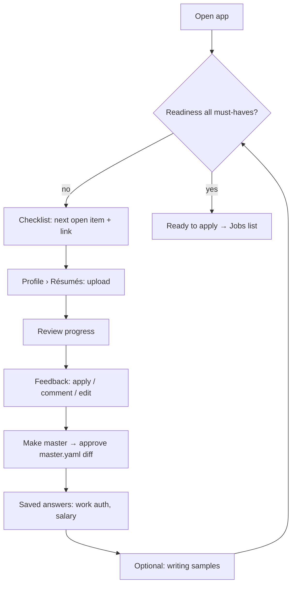
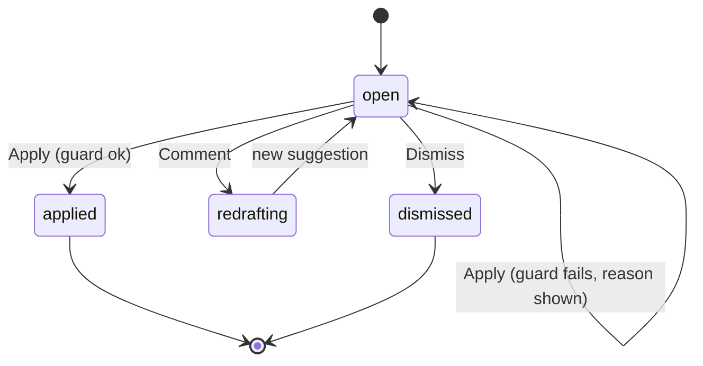

# User flows
Only flows with branching or state. Status in trace.yaml.

### FLOW-001 First run to ready
UCs: UC-001, UC-002, UC-003, UC-005, UC-006

What to notice: the checklist is the hub; every step returns to it, so a user who leaves mid-way resumes at the next open item.

### FLOW-002 Feedback item lifecycle
UCs: UC-002

What to notice: nothing reaches the résumé except via `applied`, and only after the zero-fabrication guard.
