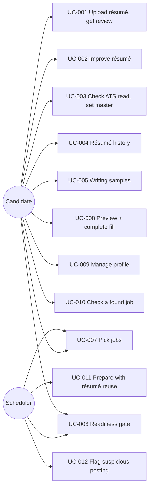

# Use cases
Onboarding & profile (Feature lane 2026-10-04). Status in trace.yaml. Actor = candidate unless noted.

What to notice: scheduler touches only the gate and job selection; every other step is the candidate's choice.
UC-006 sits in front of all apply paths, manual or scheduled.

### UC-001 Upload résumé, get review
REQs: REQ-093, REQ-094 · Pre: `careeros init` done · Trigger: drop file on Profile › Résumés
Main: 1 validate type/size 2 store v1 author=user 3 start review run 4 progress screen streams 5 feedback list shown
Alt: user leaves page → review continues; Résumés row shows "reviewing", reopen shows result
Fail: bad type/size → inline error, nothing stored · `claude` missing/timeout → `failed` + Retry, file kept
Outcome: résumé stored, feedback items open
E2E-001-01: Given fresh profile When upload 1-page PDF Then v1 listed and review result has ≥1 feedback item (fake skill runner).
E2E-001-02: Given upload When file is `.png` Then error shown and `profile/resumes/` unchanged.

### UC-002 Improve résumé
REQs: REQ-095, REQ-096, REQ-097 · Pre: UC-001 done · Trigger: Apply / Comment / Edit on a résumé
Main: Apply → section rewrite → guard → vN+1 author=ai + diff · Comment → suggestion re-drafted → Apply or Dismiss · Edit → save vN+1 author=user
Fail: guard finds new number/employer/tool → version not created, item shows reason
Outcome: new version, provenance recorded
E2E-002-01: Given item When Apply Then v2 author=ai, diff shown, item `applied`.
E2E-002-02: Given AI rewrite adding "40%" absent from v1 When guard runs Then no v2, item open with reason.
E2E-002-03: Given v2 When manual edit + Save Then v3 author=user.

### UC-003 Check ATS read, set master
REQs: REQ-098, REQ-099 · Trigger: open ATS view / "Make master"
Main: ATS view: text + fields + warnings · Make master → old master → `variant` → master.yaml diff proposed → user approves → written atomically
Alt: user rejects diff → master flag set, master.yaml untouched, readiness item stays open
Fail: extraction finds no text → warning, Make master still allowed, diff empty
E2E-003-01: Given same PDF twice When ATS view Then identical output.
E2E-003-02: Given A master When mark B master Then A=`variant`, diff proposed, master.yaml unchanged until approve.

### UC-004 Résumé history
REQs: REQ-100 · Trigger: open résumé
Main: list résumés → versions (author, time, source) → open any → delete old version
Fail: delete latest master version / master résumé → refused with reason
E2E-004-01: Given v1..v3 When delete v1 Then v2,v3 remain; delete v3 of master refused.

### UC-005 Writing samples
REQs: REQ-101 · Trigger: upload/remove on Profile › Writing samples
Main: store sample → learn-voice runs in background → list updated → future cover letters `voice_verified: true`
Alt: remove last sample → learned style cleared, `voice_verified: false`
Fail: learn-voice fails → sample kept, banner + Retry
E2E-005-01: Given 0 samples When upload 2 Then learn-voice called once, list shows 2.

### UC-006 Readiness gate
REQs: REQ-102, REQ-103 · Actor: candidate, scheduler · Trigger: open Today/Profile; any apply path
Main: checklist computed → items with links → all must-haves done → "Ready to apply", apply enabled
Fail: must-have open → apply refused (CLI exit 7, UI disabled with reason, scheduled apply skipped + Action Item once)
E2E-006-01: Given no master résumé When `careeros run apply --job X` Then exit 7 listing "master résumé".
E2E-006-02: Given all must-haves done When GET /api/readiness Then `ready: true`.

### UC-007 Pick jobs
REQs: REQ-104 · Actor: candidate; scheduler reads selection · Trigger: Jobs list checkboxes
Main: scout adds jobs unticked → scored → user ticks some (bulk ok) → prepare/apply runs take only ticked
Alt: untick mid-run → current step finishes, no later stage
E2E-007-01: Given 10 jobs, 3 ticked When `run prepare` Then exactly those 3 prepared.
E2E-007-02: Given ticked job When untick Then `tick` never schedules it.

### UC-008 Preview + complete fill
REQs: REQ-105, REQ-106 · Pre: job prepared, ready (UC-006) · Trigger: "Preview fill" on job
Main: plan table → edit values → unknown fields asked (fill/skip optional) → save-to-profile per answer → Fill
Alt: CLI/scheduled run hits unknown field → Action Item, job paused
Fail: required field skipped → Fill disabled · legal/salary/EEO unanswered → existing pause (REQ-030)
E2E-008-01: Given plan When edit "Notice period" + Fill Then fill_summary read-back = edited value.
E2E-008-02: Given unknown required field When answered with save on Then standard_answers has it, next plan auto-fills.

### UC-009 Manage profile
REQs: REQ-107 · Trigger: open Profile
Main: sections résumés, samples, saved answers (view/edit/delete), learned (lessons, voice), readiness
Fail: YAML write fails → error, file unchanged (atomic)
E2E-009-01: Given 12 saved answers When delete one Then YAML has 11 and next plan no longer uses it.

### UC-010 Check a found job
REQs: REQ-114, REQ-115, REQ-116, REQ-111 · Trigger: Jobs › Check a job
Main: 1 paste/upload JD 2 scan (REQ-109) 3 fit + per-résumé match 4 best ≥ threshold → "use this résumé"
Alt: none ≥ threshold → offer tailor → result ≥ threshold → use it
Fail: tailored still below → notice X/Y + missing skills → ask keep closest; bad file → inline error
Outcome: job stored with chosen résumé or `below_threshold` attempt
E2E-010-01: Given 2 résumés scoring 82/55, threshold 70 When check pasted JD Then 82 résumé marked best, no tailor run.
E2E-010-02: Given all résumés < 60 and fake tailor returning 64 When check Then notice "64/70" and Yes keeps attempt flagged `below_threshold`.

### UC-011 Prepare with résumé reuse
REQs: REQ-112, REQ-113 · Trigger: `run prepare` on selected jobs
Main: 1 score existing résumés 2 best ≥ threshold → reuse 3 else tweak if gain ≥ min 4 else full tailor
Outcome: fewest new résumés; reason logged per job
E2E-011-01: Given 5 similar jobs and variant scoring ≥ 70 on all When `run prepare` Then 0 tailor skill calls, 5 jobs link the variant.

### UC-012 Flag suspicious posting
REQs: REQ-108, REQ-109, REQ-110 · Trigger: posting stored (scout, check, import)
Main: 1 scan 2 hit → flag + Action Item + badge 3 user reviews → "I checked it" → prepare allowed
Fail: artifacts with untrusted contact info/URLs → QA hard fail
Outcome: injected instructions never acted on
E2E-012-01: Given recorded posting with hidden "ignore previous instructions" When scouted Then flagged and `run prepare --job X` exits 2 until cleared.
E2E-012-02: Given fake tailor output containing an unknown URL When qa runs Then hard fail `untrusted_content`.
